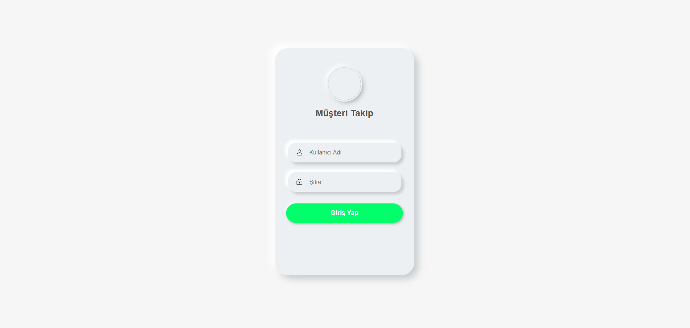
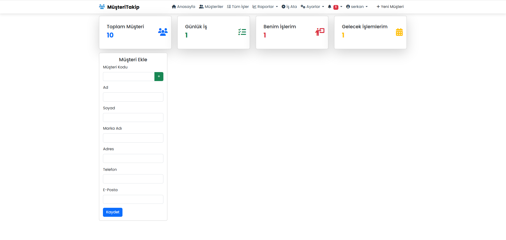
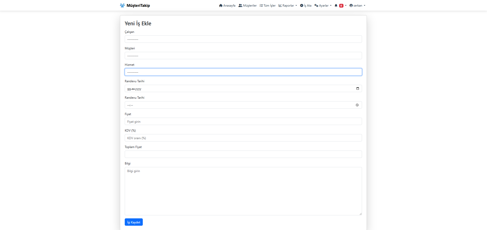
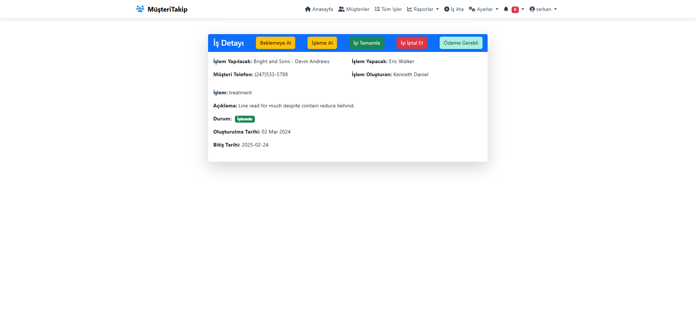
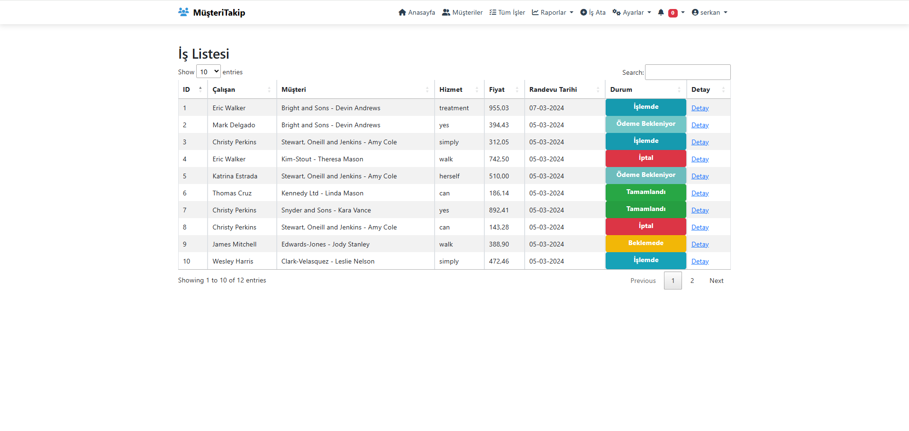
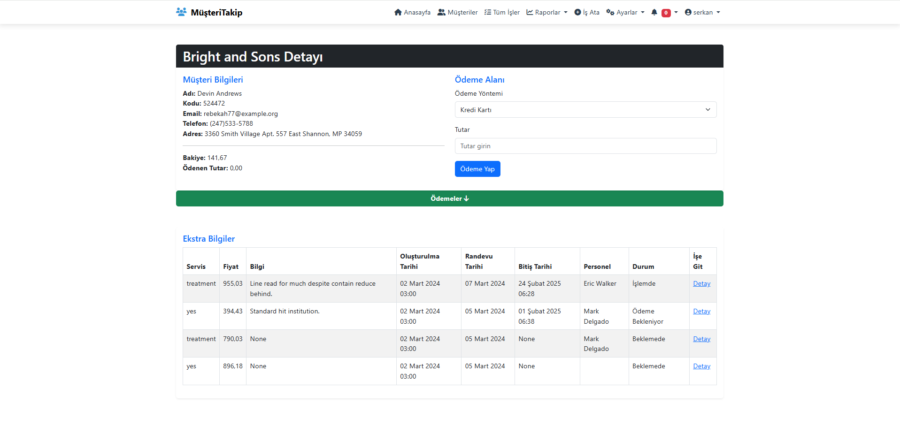
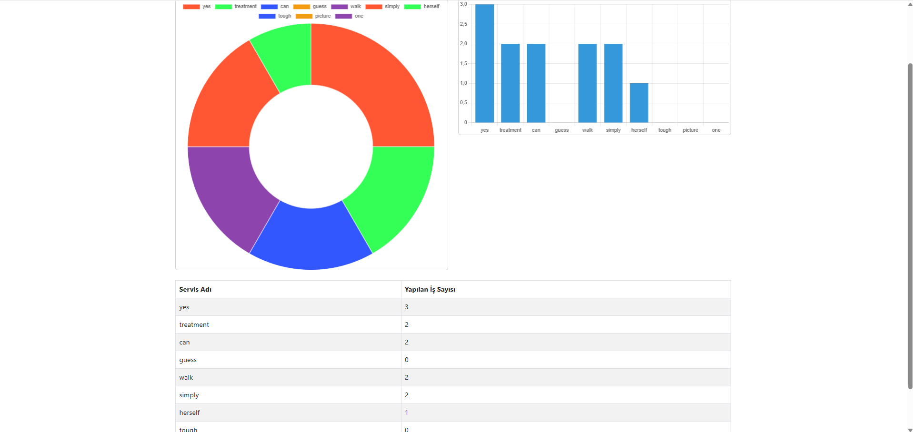

# Client Tracker

Client Tracker, müşteri, hizmet ve iş takibini kolaylaştıran bir web uygulamasıdır. Django framework'ü kullanılarak geliştirilmiştir.

## Özellikler

- Kullanıcı kimlik doğrulama sistemi
- Müşteri ve çalışan yönetimi
- Hizmet ve iş takibi
- Ödeme kayıtları
- Dinamik raporlama ve veri analizi

## Kurulum

### 1. Depoyu Kopyalayın

```sh
git clone https://github.com/serkancakmakk/client_tracker.git
cd client_tracker
```

### 2. Sanal Ortamı Oluşturun ve Aktif Edinu

```sh
python -m venv env
source env/bin/activate  # macOS/Linux
env\Scripts\activate  # Windows
```

### 3. Bağımlılıkları Yükleyin

```sh
pip install -r requirements.txt
```

### 4. Veritabanını Güncelleyin

```sh
python manage.py migrate
```

### 5. Süper Kullanıcı Oluşturun

```sh
python manage.py createsuperuser
```

### 6. Sunucuyu Çalıştırın

```sh
python manage.py runserver
```

## Kullanılan Teknolojiler

- **Backend:** Django, Django ORM
- **Frontend:** Bootstrap, JavaScript
- **Veritabanı:** SQLite
- **Kimlik Doğrulama:** Django Authentication

## API Kullanımı

JSON formatında veri almak için API uç noktaları mevcuttur. Örneğin:

```sh
GET /api/customers/
```

### Giriş Ekranı

### Ana Ekran

### Kullanıcı ve Servis Ekleme Ekranı

### Giriş yapmış kullanıcıya ait işler ekranı

### İş atama ekranı

### İş detay ekranı

### İş listesi ekranı

### Müşteri detay ekranı

### Yapılan iş rapor ekranı



